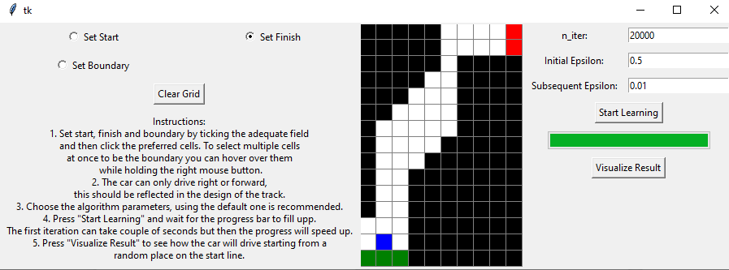

# Racetrack

The main part of this project is my implementation of a reinforcement learning algorithm (Off-policy Monte Carlo control).
It is used to solve a task from the book called Reinforcement Learning by Richard S.Sutton and Andrew G. Barto. 
The task is to learn how to finish a very simple car race using the previously mentioned algorithm.
Besides the implementation this project includes a graphical user interface for setting up the track, algorithm parameters and visualizing the results.
## Usage

1. Run the main script (you will only need python and numpy):
    ```sh
    python main.py
    ```

2. Follow the on-screen instructions to interact with the application.

3. Using default values for the first try is recommended.

## Example 



